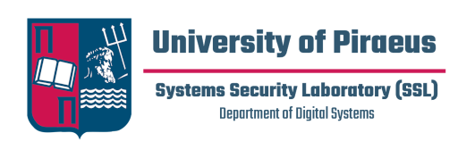

# Πανελλήνιος Μαθητικός Διαγωνισμός Κυβερνοασφάλειας (ΠΜΔΚ)

O [Πανελλήνιος Μαθητικός Διαγωνισμός Κυβερνοασφάλειας](https://ecsc.gr/index.php/pmdk/) είναι ο πανελλαδικός διαδικτυακός Jeopardy-style Capture-The-Flag διαγωνισμός για μαθητές και μαθήτριες της Α΄, Β΄ και Γ΄ Λυκείου όλων των σχολείων της Ελλάδας. Ο διαγωνισμός διοργανώνεται από το [Τμήμα Ψηφιακών Συστημάτων του Πανεπιστημίου Πειραιώς](https://www.ds.unipi.gr) με την υποστήριξη των μελών της [Εθνικής Ομάδας Κυβερνοασφάλειας](https://ecsc.gr).

  
  
  

## Διαγωνισμοί

|   # | Σχολικό Έτος | Σύνδεσμος Ιστοσελίδας | Σύνδεσμος Δοκιμασιών |
| --: | ------------ | :-------------------- | :------------------- |
| 1ος | 2022-2023    | [link](https://ecsc.gr/index.php/panellhnios-mathitikos-diagonismos-kybernoasfaleias-2023/) | [Δοκιμασίες](https://github.com/UniPiSSL/pmdk-2023)  |
| 2ος | 2023-2024    | [link](https://ecsc.gr/index.php/panellhnios-mathitikos-diagonismos-kybernoasfaleias-2023/) | [Δοκιμασίες](https://github.com/UniPiSSL/pmdk-2023) |
| 3ος | 2024-2025    | [link](https://ecsc.gr/index.php/panellhnios-mathitikos-diagonismos-kybernoasfaleias/)      | - |
